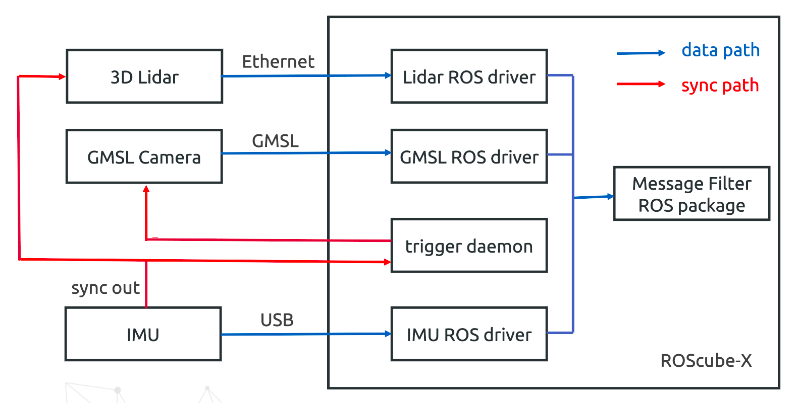

Architecture
============

In the scenario, we'll use the following hardware:

* Platform: ROScube-X 58G
* Camera: LI-AR0233-GMSL2.
* 3D Lidar: Velodyne VLP-16
* IMU: Xsens MTi-670-DK

Here is the architecture of our scenario:

The key point here is that we should use the same trigger source.
The trigger source we use is from Xsens IMU sync out.
Then it triggers 3D Lidar to do phase lock and triggers GMSL camera to capture images on ROScube-X
Since these sensors are triggered at the same time, we can assume the received data from sensors is the time-syned data.

For the software, each kind of sensor needs to run its own ROS driver to get sensor data.
To put these sensor data together, we'll use message filter ROS package to collect them.
Users can do their own sensors fusion algorithm based on the message filter.

