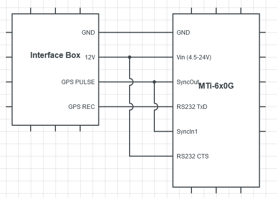
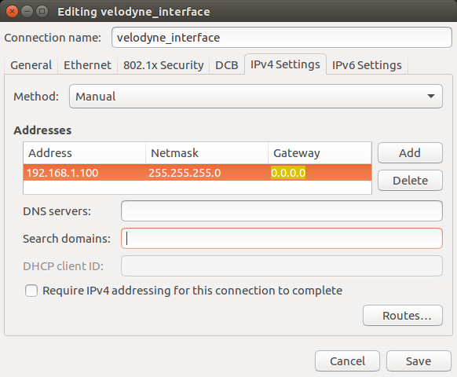
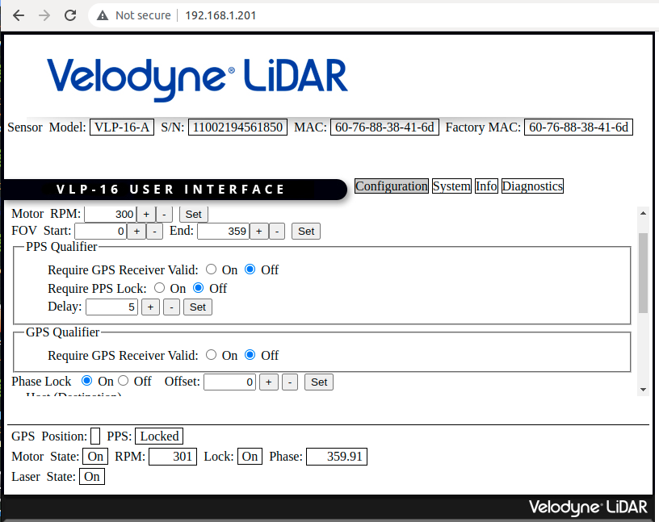
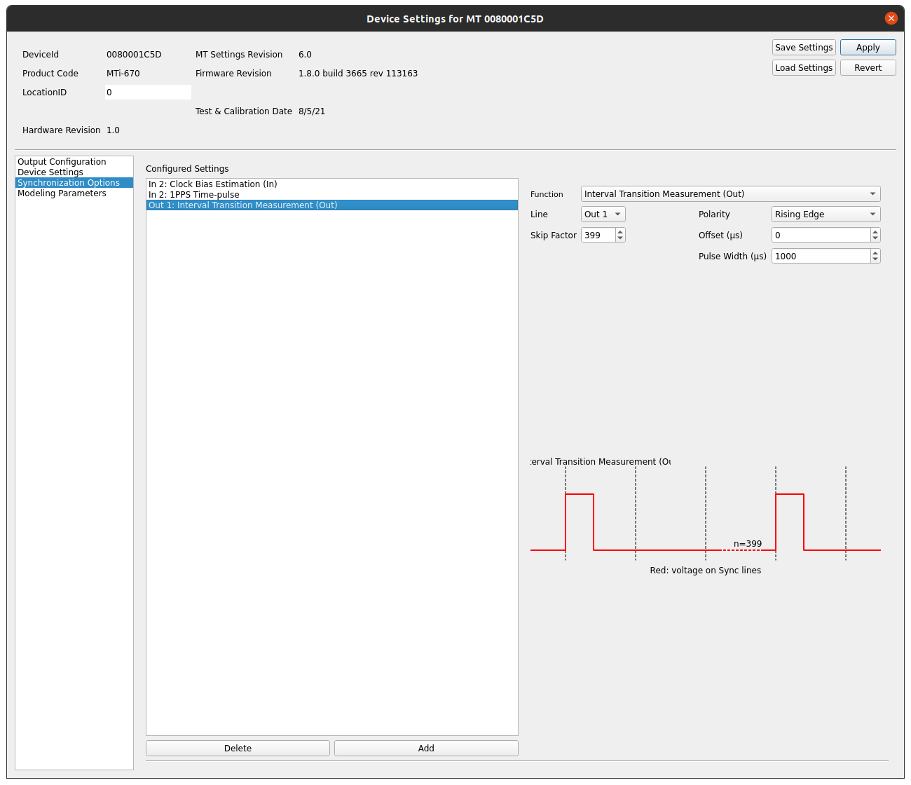

Sensor Configuration
====================

In this page, we will show you how to connect and configure the sensors, including GMSL camera, 3D Lidar and IMU.

.. image:: images/connection-result.jpeg
    :width: 80%
    :align: center

Sensors Connection
^^^^^^^^^^^^^^^^^^

Connect sensor to ROScube
*************************

We are using three kinds of sensors and each of them have their own connection interface. 
Let's connect them to ROScube.

* Camera: GMSL cable
* 3D Lidar: Ethernet
* IMU: USB

Connect time sync trigger source
********************************

The external trigger source we use here is the SyncOut from MTi 6x0G IMU.
We need to connect GMSL camera and 3D Lidar to the trigger source.

For the GMSL camera, we can only trigger it from ROScube,
so we'll connect the trigger source to one of the ROScube-X GPIO input.

For the **3D lidar**, refer to figure from `Interfacing an MTi GNSS/INS device with a Velodyne Lidar <https://base.xsens.com/s/article/Interfacing-an-MTi-GNSS-INS-device-with-a-Velodyne-Lidar?language=en_US>`_.

Connect SyncOut from **MTi 6x0G** to GPIO 5 pin of **ROScube**:

.. image:: images/imu.jpeg
    :width: 80%
    :align: center

.. image:: images/gpio.jpeg
    :width: 80%
    :align: center

.. note:: 

    You might find that we don't use all the GNSS functions here.
    All we want is to use 1PPS signal to make lidar do phase lock.

Camera Configuration
^^^^^^^^^^^^^^^^^^^^

Trigger mode
************

Change the trigger mode on RQX-58G by following the commands below:

.. code-block:: bash

    su root
    echo 1 > /sys/module/leopard_ar0233/parameters/trigger_mode
    i2cset -f -y 2 0x66 0x04 0xff

For more detail, refer to `GMSL Camera Frame Sync Configuration <https://adlink-ros.github.io/roscube-doc/roscube-x/gmsl_camera/frame_sync.html>`_.

3D Lidar Configuration
^^^^^^^^^^^^^^^^^^^^^^

Communicate
***********

Setting up your computer to communicate with the Velodyne sensor

1. Power the Lidar.
2. Connect the Lidar to Ethernet port on your PC.
3. For now, disable the WiFi connection on your PC.
   
IP configuration
****************

1. Open **Networks Connections** on your PC and click on **edit**. Choose the **IPV4 Settings** tab and change the **Method** field to **Manual**.
2. Click on "Add" and set the IP address field to ``192.168.1.100`` ("100" can be any number except in a range between 1 and 254, except 201).
3. Set the **Netmask** to ``255.255.255.0`` (24) and **Gateway** to ``0.0.0.0``.
4. To finish it, click on **Save**.

Velodyne configurations
***********************

To check the connection open your web browser and access the following sensor's network address: ``192.168.XX.YY`` (default: ``192.168.1.201``). 

The following page should appear:

1. In this web, set the **Montor RPM** of 3D Lidar. Range from 300 (5 hz) to 1200 (20 hz).
2. set the **Phase Clock** to ``On`` and **save**.

IMU Configuration
^^^^^^^^^^^^^^^^^

Configurations
**************

1. Download MT Manager from `Xsens <https://www.xsens.com/software-downloads>`_ and install it.

2. In MT Manager, open the Device Settings window. 

3. In the Synchronization Options tab, the ``Clock Bias Estimation (In)`` and the ``1PPS Time-pulse`` features should already be present in the list of configured settings, both on line **In 2**.

    * Click Add, and select the ``Interval Transition Measurement`` function. Set **Skip Factor to 399**. Leave the other fields as is. This will create a **1 PPS signal** on the SyncOut line of the MTi. Click Apply.

.. note::

    MT Manager didn't support with **ARM** version, so please use **x86** PC to do the setting.
     