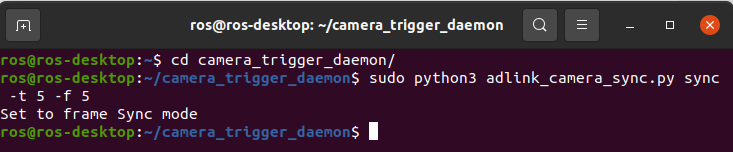

Software Configuration
======================

After sensor configuration, then we need to do the following software configuration.

* ROS environment setup
* Camera daemon installation
* Sensors ROS driver installation

ROS environment setup
^^^^^^^^^^^^^^^^^^^^^

We'll use ROS 2 to receive data from each sensors.
The first step here is to install ROS environment, and we choose ROS 2 foxy, which is the LTS version.

However, RQX-58G only supports Ubuntu 18.04, while ROS 2 foxy can only run on Ubuntu 20.04.
We suggest to use Neuron Startup Menu to install ROS 2 foxy.
For more details, refer to `The installation guide of Neuron Startup Menu <https://adlink-ros.github.io/roscube-doc/neuronsdk/neuron_startup_menu/installation.html>`_

.. code-block:: bash

    # Install Neuron Startup Menu
    sh -c "MENU_CONFIG=ros_menu_20.04_container.yaml USE_CONTAINER=True $(curl -fsSL https://raw.githubusercontent.com/Adlink-ROS/ros_menu/main/scripts/setup.sh)"
    # Install docker
    sudo apt install docker.io
    sudo groupadd docker
    sudo gpasswd -a $USER docker
    sudo reboot

Camera daemon installation
^^^^^^^^^^^^^^^^^^^^^^^^^^

While GMSL camera is frame synce mode, we need to trigger it continuously.
ADLINK provides a daemon to do this for you.
The daemon can not only trigger the camera but also recieve GPIO IN to do the synchronization.

Installation
------------

.. code-block:: bash

    # Install Neuron Library
    sudo apt install neuron-library
    # Get the code from GitHub
    cd ~
    git clone https://github.com/Adlink-ROS/camera_trigger_daemon.git
    cd camera_trigger_daemon

For more details, refer to `The installation guide of Neuron Library <https://adlink-ros.github.io/roscube-doc/neuronsdk/neuron_library/index.html>`_.

Usage
-----

Before running the daemon, make sure you have the correct sensors configuration.

The daemon provides two function:

* Sync mode:

  1. set frame sync mode
  2. enable isr if gpio_num != None
  3. enable trigger daemon

* Free mode:  

  1. disable trigger daemon 
  2. set free run mode

While sync mode, supports two options
  * -f freq: the trigger frequency (default 5 Hz)
  * -t gpio_num: whether triggered by GPIO in

.. code-block:: bash

    # Sync mode: start the daemon
    # To trigger camera by 5 Hz with ISR (from GPIO_NUM 5).
    sudo python3 adlink_camera_sync sync -f 5 -t 5

    # Free mode: stop the daemon.
    sudo python3 adlink_camera_sync free

.. warning:: 

    If the daemon didn't work, please check the ``daemon.log`` file.

For more details, refer to `The Camera Trigger Daemon <https://github.com/Adlink-ROS/camera_trigger_daemon>`_. 

Testing the camera
------------------

.. note:: 
    
    You should run camera trigger daemon first before start camera streaming.

Make sure you've already installed camera driver and run the following command to see whether the streaming is shown or not.

.. code-block:: bash

    # Open a terminal and type command to open camera 1's video streaming.
    gst-launch-1.0 nvarguscamerasrc sensor-id=0 ! 'video/x-raw(memory:NVMM), width=2048, height=1280, framerate=30/1' ! nvvidconv flip-method=0 ! 'video/x-raw, format=(string)I420' ! xvimagesink -e
    # Can change the snesor-id for other cameras.

For more details, refer to `The tutorial of camera usage <https://adlink-ros.github.io/roscube-doc/roscube-x/gmsl_camera/camera_usage.html>`_.

Sensors ROS driver installation
^^^^^^^^^^^^^^^^^^^^^^^^^^^^^^^

Sensors ROS driver ``sensors_pkg`` includes the ROS driver of sensors we use and message filter package to collect sensors data.
We can collect camera, lidar and IMU data at the same time.
This is the first step for users to do the sensor fusion.

Install necessary packages
--------------------------

.. code-block:: bash

    sudo apt install wget

Get the code
------------

.. code-block:: bash

    mkdir -p sensors_pkg_ws/src
    cd sensors_pkg_ws
    wget https://raw.githubusercontent.com/Adlink-ROS/sensors_pkg/main/sensors.repos
    vcs import src < sensors.repos

Build xsens library 
-------------------

Refer to https://github.com/bluespace-ai/bluespace_ai_xsens_ros_mti_driver

.. code-block:: bash

    pushd src/bluespace_ai_xsens_ros_mti_driver/lib/xspublic && make && popd

Build
-----

.. code-block:: bash

    rosdep install --from-paths src --ignore-src -r -y
    colcon build --symlink-install
    source install/local_setup.bash
