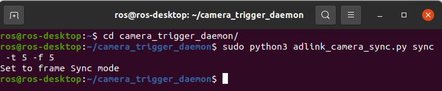

Time synchronization
====================

In this page will show you how to do **Time Synchronization**.

Usage
^^^^^

1. Run ``camera_trigger_daemon`` 
--------------------------------

* Run ``camera_trigger_daemon``  by command line:

.. code-block:: bash

    cd ~/camera_trigger_daemon

    # Sync mode: start the daemon
    # To trigger camera by 5 Hz with ISR (from GPIO_NUM 5).
    sudo python3 adlink_camera_sync sync -f 5 -t 5

    # Free mode: stop the daemon.
    sudo python3 adlink_camera_sync free

.. note::
    
    Trigger the frame first before running camera streaming. 

2. Run ``nvargus-daemon`` 
-------------------------

* Open **secound** terminal and run **ROS 2 foxy** by ``ros_menu``.

* Run ``nvargus-daemon``. The reason why we need to run ``nvargus-daemon`` separately is that we are using docker to run ROS 2, not the native system.

.. code-block:: bash

    nvargus-daemon

.. warning::

    If you find that Argus plugin can't operate well, you can restart ``nvargus-daemon``.

3. Launch ``sensors_pkg`` 
-------------------------

* Open **third** terminal and run **ROS 2 foxy** by ``ros_menu``.

* To view the timestamp of camera, lidar and imu by launch ``sensors_pkg``

.. code-block:: bash

    # Launch camera, lidar and message filter at the same time
    ros2 launch sensors_pkg launch_sensors.launch.py
    
    # If you also want to enable IMU, add the option.
    # However, it'll affect the performance of message filter, so default is disable.
    ros2 launch sensors_pkg launch_sensors.launch.py enable_imu:=true

