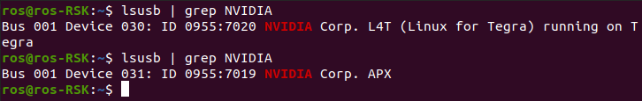

.. _flash_mfi:

How to flash MFI
################

1. Parepare mfi image on your host computer.
--------------------------------------------

i) Download mfi image.  

 a.   Go to the `device web <https://www.adlinktech.com/Products/ROS2_Solution/ROS2_Controller/ROScube-X?lang=en/>`_.  
 b.  Login or create an account.  
 c. Click BSP to download the BSP MFI Binary  

ii) Install required tools.

.. code-block:: bash

  $> sudo apt install python qemu-user-static

iii) Check ROScube is in recovery mode now.

.. code-block:: bash

  $> lsusb | grep NVIDIA

.. note:: 
    
    If successful, it will show **APX**.

1. Flash image to ROScube
-------------------------

Assuming image's file name is ``RQX-580-MFI-Jetpack-4-5.zip``. Un-archive this file first.

.. code-block:: bash

    $> unzip RQX-580-MFI-Jetpack-4-5.zip

Then, use internal tool, ``nvmflash.sh`` to run the flashing procedure. **Please make sure your Host PC has attached to ROScube-X**.
Besure run ./nvmflash.sh as root permission.

.. code-block:: bash

    $> cd RQX-580-MFI-Jetpack-4-5/mfi_rqx_580
    $> sudo ./nvmflash.sh 

.. note:: 
    
    You may need to input your **host PC**'s root password when flashing the image.

.. note:: 
    
    The flashing procedure might take 8 ~ 10 minutes.

.. image:: images/nvidia-flash-success.png
  :width: 80%
  :align: center

Massive Flashing
^^^^^^^^^^^^^^^^

``nvmflash.sh`` supports massive flashing, which means you can attach multiple ROScube and run nvmflash.sh to flash the image to multiple boards at the same time.

.. warning:: 
    
    Please do not attach different models (e.g. RQX580 and RQX58G) to your host computer when using nvmflash.sh.
