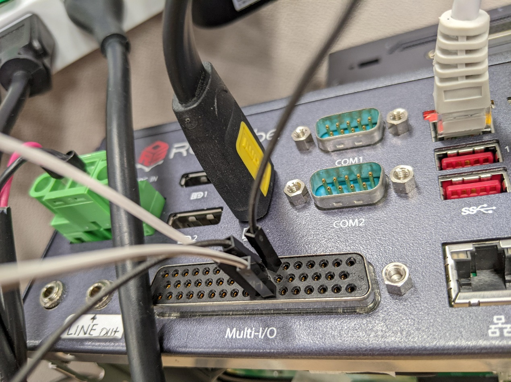
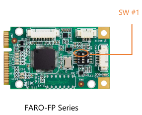
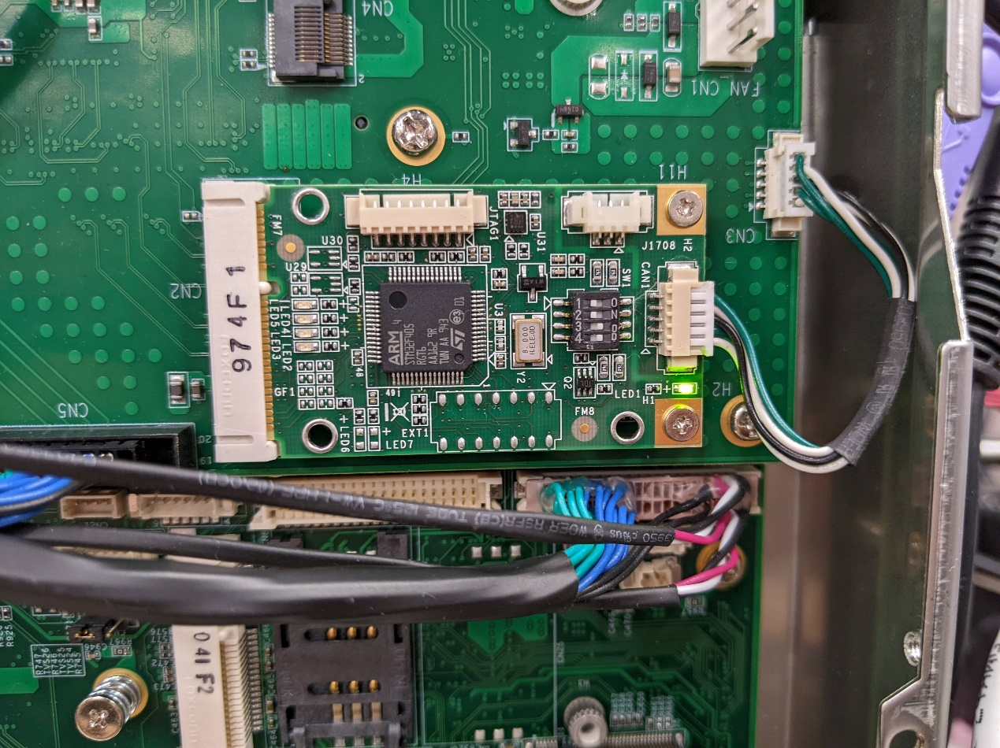
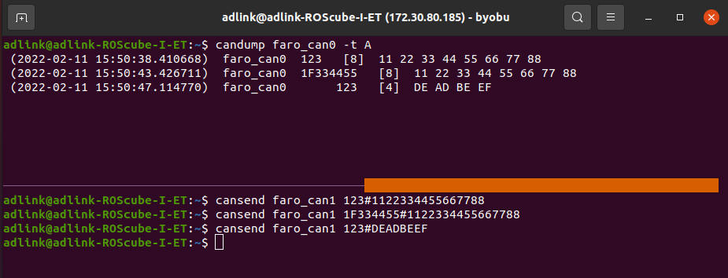

.. _canbus:

How to use CAN bus
##################

The tutorial will guide you how to use CAN bus module.

Supported Model: ROScube-I series

Installation
------------

1. Install CAN bus module into ROScube.

2. Check if the Faro module exists

.. code-block:: bash

    ls /dev/ttyUSB*

3. Install ``can-utils``

.. code-block:: bash

    sudo apt-get install can-utils

4. Decompress FARO CAN driver.

.. code-block:: bash

    tar zxvf SocketCAN_V1.0.9.tgz

5. Build ``faro_can.ko``

.. code-block:: bash

    cd SocketCAN/V1.0.9/socketCAN/faro-socketcan/
    make

6. Build ``farocand``

.. code-block:: bash

    cd SocketCAN/V1.0.9/socketCAN/faro-can-utils/
    make

7. Check version of ``faro_can.ko``

.. code-block:: bash

    cd SocketCAN/V1.0.9/socketCAN/faro-socketcan/
    modinfo ./faro_can.ko

8. Load module

.. code-block:: bash

    sudo modprobe can
    sudo modprobe can_raw
    cd SocketCAN/V1.0.9/socketCAN/
    sudo insmod ./faro-socketcan/faro_can.ko
    sudo ./faro-can-utils/farocand -s22 -S921600 /dev/ttyUSB0 faro_can0 faro_can1
    sudo ifconfig faro_can1 up
    sudo ifconfig faro_can0 up

Hardware preparation
--------------------

1. Connect Pin43 with Pin44, and Pin10 with Pin11. In that way, the CAN_PORT0 and CAN_PORT1 are connected.

.. image:: images/roscube-db50.png
  :width: 80%
  :align: center

2. Turn on the Terminal Resistor on Port 1 or Port 2.

.. image:: images/FARO-switch.png
  :width: 50%
  :align: center

3. In the picture below, we turned on the Terminal Resistor of Port 0.

Test
----

1. Open terminal 1, enter below command to wait data from faro_can0:

.. code-block:: bash

    candump faro_can0 -t A

2. Open terminal 2, enter below command to send data to faro_can1:

.. code-block:: bash

    cansend faro_can1 123#1122334455667788

3. The test result should be similar to below picture:

