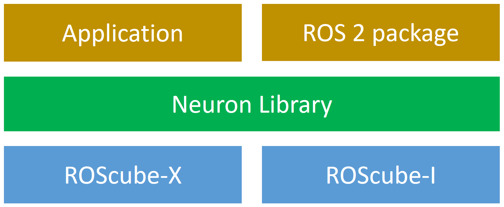

.. _neuron_library:

Neuron Library
##############

Neuron Library is the API library for ADLINK products,
such as ROScube-I and ROScube-X providing a common API to control the peripheral I/O of the controller,
and includes examples for various programming languages.

As shown in the diagram below, Neuron Library provides the interfaces between your program and the hardware.
Instead of controlling I/O using Linux commands and modifying your code for each platform,
you just need to call the API from the Neuron Library.
You can port your code between ROScube-I and ROScube-X without any modifications, only rebuilding is needed.

Since ROScube-I and ROScube-X are products that are mainly used for ROS based projects,
some ROS 2 (Foxy) examples are provided to demonstrate how to use these APIs on ROS 2.
You can rewrite these examples to build your own programs.

Supported Models:

* ROScube-I series
* ROScube-X series

**Table of Contents:**

.. toctree::
   :maxdepth: 1

   installation.rst
   usage.rst
   rosdriver.rst
 