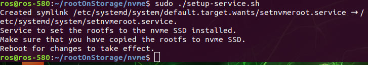

Mounting FileSystem From NVMe M.2 SSD
#####################################

When mounting a **NVMe M.2 SSD** to RQX-580 or RQX-58G, the storage will be appeared as a ``/dev/nvme0n1``
storage.

1. Format NVMe M.2 SSD to EXT4 filesystem.
------------------------------------------

.. code-block:: bash

  cd rootOnStorages/nvme
  sudo ./copy-rootfs-sdmmc.sh

.. image:: images/nvme-copy.png
  :width: 80%
  :align: center

.. note:: 
    
    After finishing, you can see ``to-chk=0/*``.

2. Setup the service. 
---------------------

This will copy the .service file to the correct location, and install a startup script to set the rootfs to the SSD.

.. code-block:: bash

  sudo ./setup-service.sh

.. note:: 
    
    After setting up the service, **reboot** for the changes to take effect.
