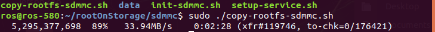

.. _mounting_sdmmc:

Mounting FileSystem From SD Card
################################

When inserting a **SD card** to RQX-580 or RQX-58G, the storage will be appeared as a ``/dev/mmcblk1`` storage.

1. Format SD card to EXT4 filesystem.
-------------------------------------

.. code-block:: bash

  cd rootOnStorages/sdmmc
  sudo ./init-sdmmc.sh

.. note:: 
    
    After format, you need **remount the SDMMC**.

2. Copy the rootfs of the eMMC to the SDMMC.
--------------------------------------------

.. code-block:: bash

  sudo ./copy-rootfs-sdmmc.sh

.. note:: 
    
    After finishing, you can see ``to-chk=0/*``.

3. Setup the service. 
---------------------

This will copy the .service file to the correct location, and install a startup script to set the rootfs to the SD card.

.. code-block:: bash

  sudo ./setup-service.sh

.. image:: images/sdmmc-setup.png
  :width: 80%
  :align: center

.. note:: 
    
    After setting up the service, **reboot** for the changes to take effect.

