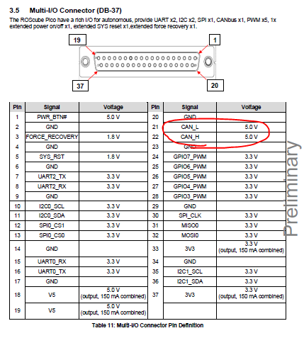

How to use CAN bus
##################

The tutorial will guide you how to use CAN bus on NVIDIA Platform.

Supported Model: 

    * ROScube-X series
    * ROScube-Pico series

Hardware Pinout
---------------

* For ROScube-X series

* For ROScube-Pico series

Configuration
-------------

1. Make the system update

.. code-block:: bash

    sudo apt update
    sudo apt upgrade

2. Configure the bitrate for can0

.. code-block:: bash

    sudo ip link set can0 type can bitrate 1000000

In this command, **bitrate** can be any valid CAN bitrate for stand CAN.

.. note:: 

    | 125000(125 Kbps), 250000(250 Kbps), 500000(500 Kbps) and 1000000(1Mbps) are supported bitrates for Tegra MTTCAN driver.
    | Any other bitrate is not validated on Tegra MTTCAN driver.
 
3. Turn on can0

.. code-block:: bash

    sudo ip link set can0 up

4. Enter ``ifconfig``, then you should see can0

.. image:: images/ifconfig.png
  :width: 50%
  :align: center

Test
----

1. To send CAN bus data out of can0:

.. code-block:: bash

    candump can0 -t A

2. To receive CAN bus data from can0:

.. code-block:: bash

    cansend can0 123#1122334455667788