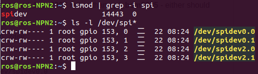

.. _spi_test:

How to Test SPI
###############

| BMI160 SPI by using ``/dev/spidevx.x``.
| The spidev_test code used comes from `rm-hull/spidev-test <https://github.com/rm-hull/spidev-test>`_. If you want to get more details about the code, you can check it.

Default setting in the code:

    * The default device was ``/dev/spidev0.0``.
    * The default mode were ``SPI_IOC_WR_MODE`` and ``SPI_IOC_RD_MODE``.

You can change these setting on the file ``spidev_test.c``.

1. Building Test Tool
---------------------

Download the code, please use the following command.

.. code-block:: bash

    git clone https://github.com/rm-hull/spidev-test
    cd spidev-test
    gcc spidev_test.c -o spidev_test

2. Check SPI 
------------

You can confirm whether it is enabled using the shell commands below:

.. code-block:: bash

    lsmod | grep -i spi
    ls -l /dev/spi*

.. note:: 
    
    If the devices are successfully installed, they will be installed in `/dev`.

3. Testing the SPI bus
----------------------

On the device **ROScube Pico NX**, we are using `/dev/spidev2.0`.

You can check the Chip ID of BMI160 by using the following command below:

i) Create the file of input data.

.. code-block:: bash

    printf "\x80\xff" >chipID.bin 

ii) Send the file. 

.. code-block:: bash

    ./spidev_test -v -D /dev/spidev2.0 -i chipID.bin

iii) Check the received data.

.. image:: images/spidev-test-chipid.png
  :width: 80%
  :align: center

.. note:: 
    
    If SPI bus successfully worked, you will received **FF D1**.

    The chip ID of BMI160 is ``0xD1``.

.. note::

    If you want to get more information about **BMI160**, click `BMI160 Datasheet <https://www.bosch-sensortec.com/media/boschsensortec/downloads/datasheets/bst-bmi160-ds000.pdf>`_.

