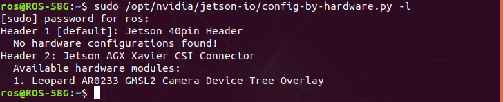
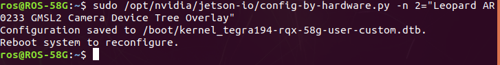
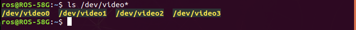

.. _camera_driver:

Camera Driver Installation
##########################

You need to install dedicated Camera's driver (e.g. ``leopard-ar0233-gmsl``).

The driver is provided by **ADLINK** and could not be used on other vendor's platform since it is compiled into binary.

And it can only download form **ADLINK ROScube's APT repository**.

1. Install Camera Driver.
-------------------------

To install **Leopard AR0233 GMSL** camera, please by following terminal commands below:

.. code::
    
    sudo apt update
    sudo apt install leopard-ar0233-gmsl

2. Inspect Camera Driver.
-------------------------

To inspect your available camera device tree setting after installing, please use the following terminal command:

.. code::

    sudo /opt/nvidia/jetson-io/config-by-hardware.py -l

.. warning::

    It can only install one cammera's driver at the same time.

    If there are two or more, please remove them which you don't use.

3. Apply Device Tree Settings.
------------------------------

To apply **Leopard AR0233 device tree** settings to all camera channels, please use the following terminal command:

.. code::

    sudo /opt/nvidia/jetson-io/config-by-hardware.py -n 2='Leopard AR0233 GMSL2 Camera Device Tree Overlay'

.. note::

    To reconfigure, please **reboot** system.

4. Check Camera.
----------------

After rebooting system, you can check if the cameras are available.

Please use the following terminal command:

.. code::

    ls /dev/video*

.. warning::
    
    If it can't show any video devices, make sure cameras are connected.

    And check the error message by ``dmesg | egrep ar0233`` in terminal command.
