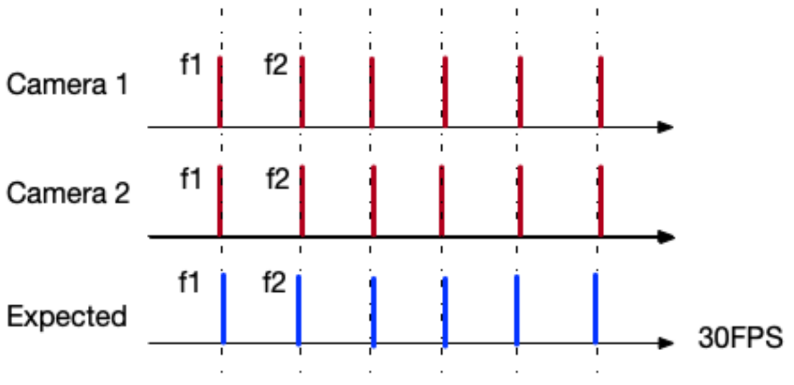
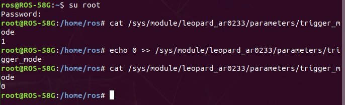
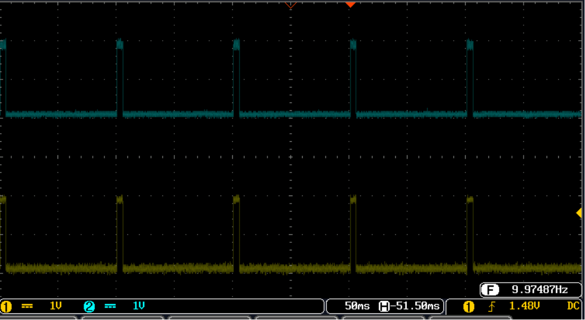
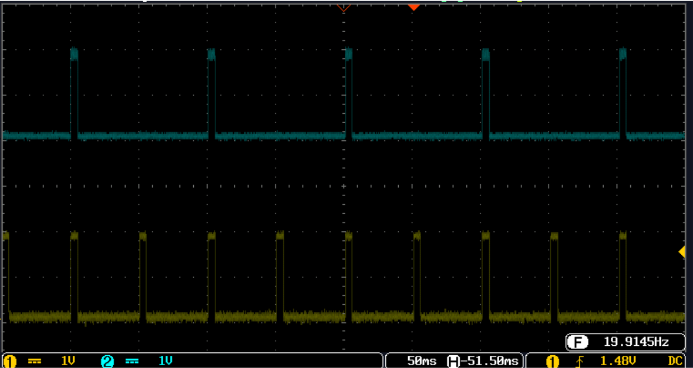

.. _frame_sync:

Frame Synchronization 
#####################

RQX-58G supports **Free Run Mode** and **Frame Sync Mode**.

Typically, if you want to use FSYNC in RQX-58G, you need to follow the procedure.
    
    i.   Set all cameras to frame sync mode by kernel modules's parameter.
    ii.  Use I/O library to trigger frames, e.g. Neuron Library.
    iii. Use Argus API or GStreamer to retrive your frame.

| Free run mode means if you are expecting every camera will have 30 FPS frame rate. 
| But every camera has different clock source, so they will not able to output the frame at the same time.

| Like the following plot.
| Camera's frame 1 (f1) and camera's frame 2 (f2) is not at the same time, therefore, under your system they are not under the same timestamp.

.. image:: images/free-run-30fps.png
  :width: 80%
  :align: center

| Frame Sync mode is a mechanism to make sure all of your camera is in passive mode, and every frame can by triggered by external signal. 
| Therefore, host side has the full permission to control when the camera to collect the frame and the received timestamp.

1. Frame Sync Configuration
---------------------------   

Different vendor's camera might have differentt way to configure free-run mode or frame sync mode.

For example,ADLINK provided **Leopard AR0233 GMSL2** camera driver has a kernel module's parameter to control all cameras are in free-run mode or fsync mode. 
(``/sys/module/leopard-ar0233/paramters/trigger_mode``)

    * 0 -> Free Run mode
    * 1 -> Frame Sync mode

To see the ``trigger_mode``  by following terminal commands:

.. code::

    su root
    cat /sys/module/leopard-ar0233/parameters/trigger_mode

To change the ``trigger_mode`` by following terminal commands:

.. code::

    su root
    echo <mode> >> /sys/module/leopard-ar0233/parameters/trigger_mode
    cat /sys/module/leopard-ar0233/parameters/trigger_mode

.. note::

    If value is **0**, which means all AR0233 camera is in free run-mode, if value is **1**, all ar0233 cameras are in frame sync mode.

2. Trigger Frames by external I/O
---------------------------------

Now we can use external I/O library to control FSYNC frequence. ROScube has provides a I/O library called **Neuron Library**.

.. code::

    sudo apt update
    sudo apt install neuron-library

Every deserializer MAX9296 is mapped to a GPIO from Xavier.

+-------------------------+-------------------------+----------------------------+
| Camera Number           | Sysfs GPIO location     | Neuron Library GPIO number |
+=========================+=========================+============================+
| MAX9296 (cam 1 - cam 2) | /sys/class/gpio/gpio408 | 50                         |
+-------------------------+-------------------------+----------------------------+
| MAX9296 (cam 3 - cam 4) | /sys/class/gpio/gpio350 | 51                         |
+-------------------------+-------------------------+----------------------------+
| MAX9296 (cam 5 - cam 6) | /sys/class/gpio/gpio446 | 52                         |
+-------------------------+-------------------------+----------------------------+
| MAX9296 (cam 7 - cam 8) | /sys/class/gpio/gpio445 | 53                         |
+-------------------------+-------------------------+----------------------------+

Example 1: 
**********

| This script will output 4 synchronized FSYNC signal to GMSL. 
| All 8 AR0233 camers will output 10FPS.

.. code::
    
  #!/bin/python3

  import sys
  sys.path.append("/opt/adlink/neuron-sdk/neuron-library/lib/python3.6/dist-packages")
  import mraa
  import time

  gpio_1 = mraa.Gpio(51)
  gpio_2 = mraa.Gpio(52)
  gpio_3 = mraa.Gpio(53)
  gpio_4 = mraa.Gpio(54)
  time.sleep(0.5)
  gpio_1.dir(mraa.DIR_OUT)
  gpio_2.dir(mraa.DIR_OUT)
  gpio_3.dir(mraa.DIR_OUT)
  gpio_4.dir(mraa.DIR_OUT)
  
  time.sleep(0.5)
  hz = 10
  interval = 1/hz
  min_fsync_interval = 0.005
  wait_idle = interval - min_fsync_interval

  for i in range(10000000):
      gpio_1.write(1)
      gpio_2.write(1)
      gpio_3.write(1)
      gpio_4.write(1)
      time.sleep(min_fsync_interval)
      gpio_1.write(0)
      gpio_2.write(0)
      gpio_3.write(0)
      gpio_4.write(0)
      time.sleep(wait_idle)

Example 2:
**********

| Provides your two 10Hz FSYNC and two 20HZ FSYNC signel output.
| Camera 1, 2, 3, 4 ouputs 10HZ and 5, 6, 7, 8 outputs 20Hz.

.. code::
  
  #!/bin/python3

  import sys
  sys.path.append("/opt/adlink/neuron-sdk/neuron-library/lib/python3.6/dist-packages")
  import mraa
  import time

  gpio_1 = mraa.Gpio(51)
  gpio_2 = mraa.Gpio(52)
  gpio_3 = mraa.Gpio(53)
  gpio_4 = mraa.Gpio(54)
  time.sleep(0.5)
  gpio_1.dir(mraa.DIR_OUT)
  gpio_2.dir(mraa.DIR_OUT)
  gpio_3.dir(mraa.DIR_OUT)
  gpio_4.dir(mraa.DIR_OUT)
  time.sleep(0.5)
  
  hz = 20
  interval = 1/hz
  min_fsync_interval = 0.005
  wait_idle = interval - min_fsync_interval
  
  for i in range(10000000):
    gpio_1.write(1)
    gpio_2.write(1)
    gpio_3.write(1)
    gpio_4.write(1)
    time.sleep(min_fsync_interval)
    gpio_1.write(0)
    gpio_2.write(0)
    gpio_3.write(0)
    gpio_4.write(0)
    time.sleep(wait_idle)
    gpio_1.write(1)
    gpio_2.write(1)
    time.sleep(min_fsync_interval)
    gpio_1.write(0)
    gpio_2.write(0)
    time.sleep(wait_idle)