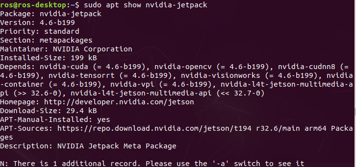
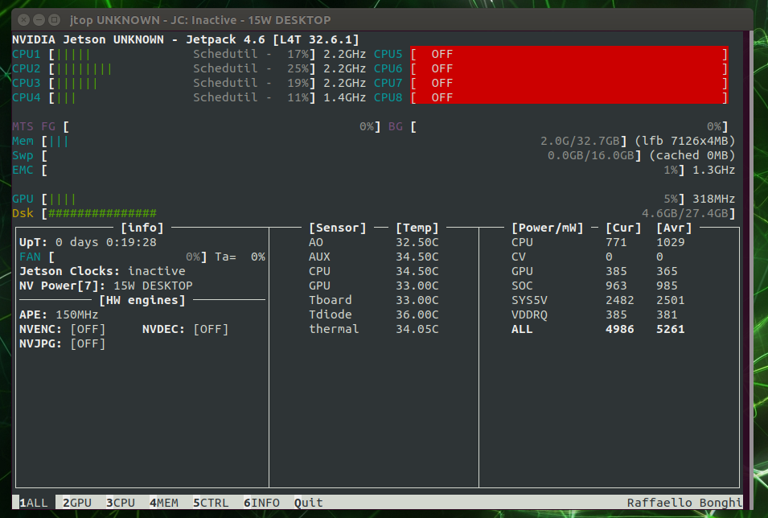
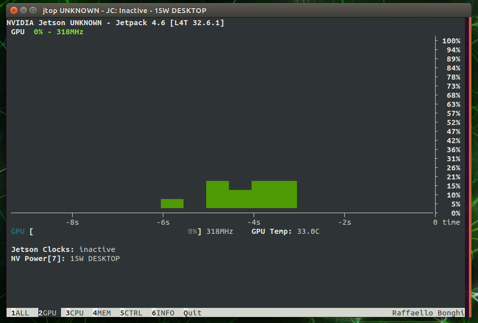
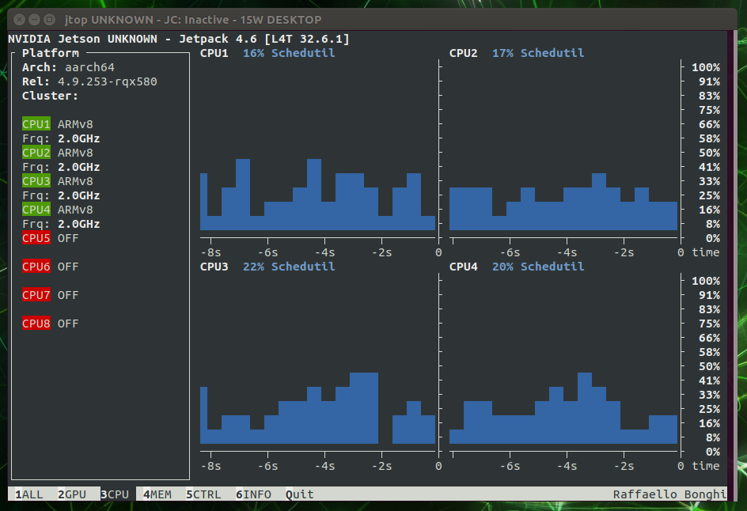

Hardware Monitor
################

| Since generic x86 computer with Nvidia GPU PCIe card under linux has a tool nvidia-smi to check GPU status, but ROscube-X and ROScube-Pico are ARM based CPU, there’s no nvidia-smi tool available. 
| You could use a third party tool: jetson-stats to monitor Jetson’s CPU, GPU and memory status.

1. Install jetson-stats.
------------------------

.. code-block:: bash

    sudo apt-get update
    sudo apt install python-pip python-dev build-essential
    sudo pip install --upgrade pip
    sudo pip install jetson-stats

.. note:: 
    
    Then **reboot** system to apply jetson-stats systemcv service.

2. Check the nvidia-jetpack.
----------------------------

.. note:: 
    
    Before using ``jetson-stats``, you should install ``nvidia-jetpack`` first.

.. code-block:: bash

    sudo apt show nvidia-jetpack

3. Run the Hardware Monitor.
----------------------------

.. code-block:: bash

    sudo jtop

* Overall Hardware Monitor Screenshoot

* GPU RealTime Monitor Screenshoot

* CPU RealTime Monitor Screenshoot

