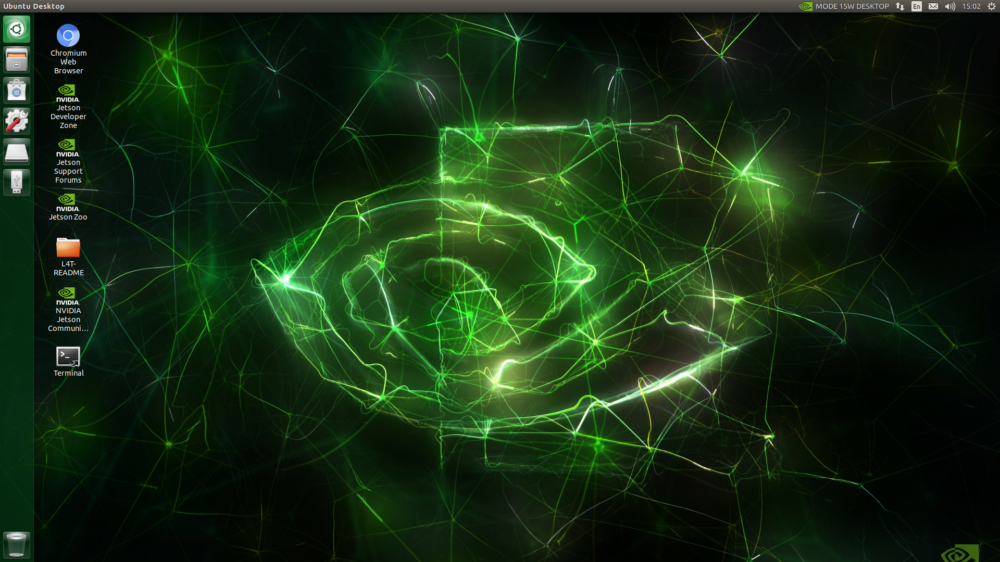

.. _setting_system:

Setting System Configuration
############################

| Power on the **ROScube**.  
| Then follow steps to set the system configuration on **ROScube**.  

  * Language
  * Keyboard Layout
  * Location
  * Username and Password
  * Nvpmodel Mode 

<<<<<<< HEAD:quick_start/setting_system.rst

=======
After configuration, you'll see the Ubuntu desktop.

>>>>>>> 4e139c950680d6ed8072cb83c269dd1a9e05be7a:nvidia/quick_start/setting_system.rst

