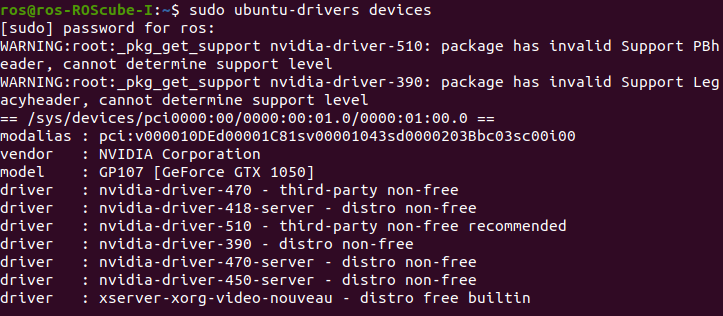

.. _nvidia_driver:

How to Install NVDIA Driver
###########################

The tutorial will guide you how to install nvidia driver.

Supported Model: ROScube-I series

1. Update your system.
^^^^^^^^^^^^^^^^^^^^^^

Running apt-get command to update system:

.. code-block:: 

    sudo apt update
    sudo apt upgrade

Find out information about your GPU:

.. code-block:: 

    lspci | grep VGA

.. image:: images/GPU-device.png
  :width: 80%
  :align: center

2. Show all driver packages.
^^^^^^^^^^^^^^^^^^^^^^^^^^^^

To show all drvier packages which apply to the current system, please type the command:

.. code-block:: 

    sudo ubuntu-drivers devices

Here is what we see:

3. Install the GPU driver. 
^^^^^^^^^^^^^^^^^^^^^^^^^^

Here show two way how to install driver:

    * Automatically installtion
    * Custom installation

Automatically installtion
-------------------------

Let us install recommended driver automatically:

.. code-block:: 

    sudo ubuntu-drivers install

Custom installation
-------------------

Install dirver which you want in drvier list:

.. code-block:: 

    sudo apt install nvidia-driver-<version>

.. warning:: 

    You can install only one driver at the same time.
    If you use automatical installation, not to try custom installation.

4. Reboot your system.
^^^^^^^^^^^^^^^^^^^^^^

.. code-block::

    sudo reboot

5. Verification.
^^^^^^^^^^^^^^^^

Open the terminal application and type ``nvidia-smi`` to see GPU info and process that are using Nvidia GPU:

.. code-block:: 

    nvidia-smi

You can see running apps on your GPU and GPU temperature.

.. image:: images/nvidia-smi.png
  :width: 80%
  :align: center

.. note:: 

    If you want to configure the NVIDIA graphics driver, please type ``sudo nvidia-settings`` in terminal.

