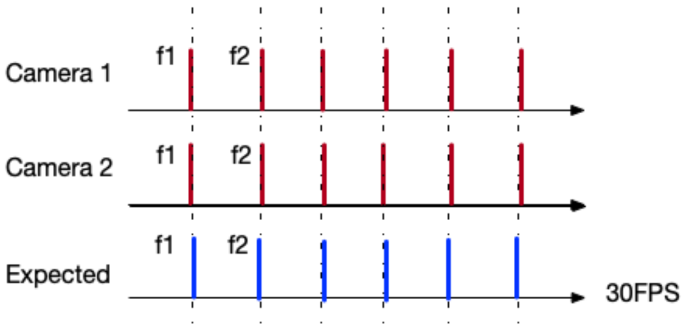
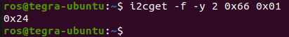
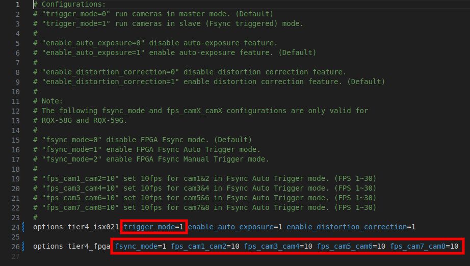
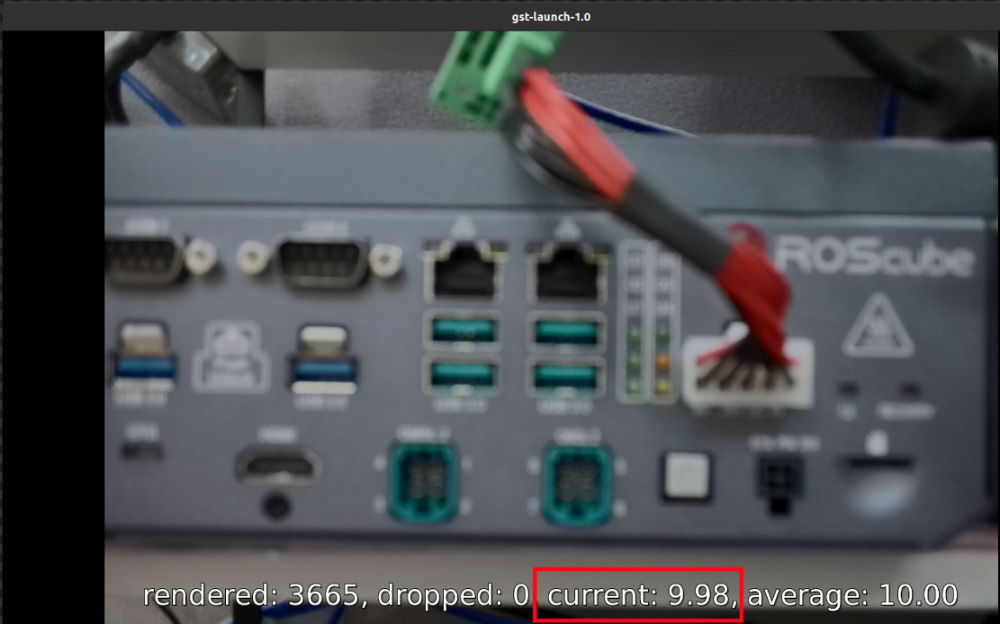

.. _frame_sync:

Frame Synchronization 
#####################

The ROScube-X compatible GMSL2 cameras can be run in the following modes:

- **Free Run mode** - The camera runs at default FPS.
- **Fsync Auto Trigger mode** - The camera shutter is automatically triggered by FPGA.
- **Fsync Manual Trigger mode** - The camera shutter is manually triggered by Application.

| For Free Run mode, the FPS is fixed at default frame rate.
| For Fsync (Frame Synchronization) mode, the FPS can be different depends on the triggering rate.

Typically, if you want to use Fsync mode, you need to follow the procedure.
    
    i.   Set all cameras to Fsync mode by kernel modules's parameter.
    ii.  Set FPGA parameter for automatically triggering. Or use I/O library to manually trigger frames.
    iii. Use GStreamer or Argus API to retrive your frame.

Why Frame Synchronization?
--------------------------

| Observe the following plot.
| Camera's frame 1 (f1) and camera's frame 2 (f2) are not at the same time. Therefore, in your system they are not under the same timestamp.

.. image:: images/free-run-30fps.png
  :width: 80%
  :align: center

| Fsync mode is a mechanism to put your cameras in passive mode, and every frame from camera is triggered by external signal.
| Therefore, we can make sure all the camera shutters are triggered at the same time. 
| Or intent to customize cameras in different frame rate.

FPGA Firmware Version and Upgrade
---------------------------------

In order to use Fsync mode, please make sure that FPGA version is at least 0x24.

.. code:: bash

    i2cget -f -y 2 0x66 0x01

  
If the version value is unable to read, you have to flash the FPGA firmware.

- For RQX-590 with ADLINK GMSL board, please go to https://github.com/Adlink-ROS/rqx-release-sw to download the flash tool and the latest firmware.
- For RQX-58G and RQX-590 with Leopard GMSL board, you have to send RQX back to ADLINK to upgrade the firmware.

Tier IV C1/C2 Frame Sync
------------------------

If you are using Tier IV Automotive HDR Camera C1/C2. To enable Fsync mode, please use a text editor to open the driver configuration file: 

- ``/etc/modprobe.d/tier4-isx021.conf`` for C1 camera
- ``/etc/modprobe.d/tier4-imx490.conf`` for C2 camera

And then follow the steps to enable Fsync mode:

  i. Set ``trigger_mode=1``.

  ii. Set ``fsync_mode=1`` for **Fsync Auto Trigger mode** or ``fsync_mode=2`` for **Fsync Manual Trigger mode**.
  
  iii. Set ``fps_camX_camX=<FPS>`` for Fsync Auto Trigger rate.

  iv. Save file and reboot system to take effect.

Here is C1 camera example for using Fsync Auto Trigger mode with 10 Hz tigger rate:

  
After reboot, enter GStreamer command on terminal to verify the trigger rate (FPS):

.. code:: bash

  gst-launch-1.0 -e v4l2src device=/dev/video0 ! 'video/x-raw,format=UYVY,width=1920,height=1280' ! videoconvert ! fpsdisplaysink video-sink=xvimagesink sync=false

In this example, the streaming result will be around 10 Hz:

If you want to use Fsync Manual Trigger Mode, please go to the section_.

Leopard AR0233 Frame Sync
-------------------------

For Leopard AR0233 users, to enable Fsync mode, please change the value from ``/sys/module/leopard_ar0233/paramters/trigger_mode``:

    * 0 -> Free Run mode
    * 1 -> Fsync mode

To see current value of ``trigger_mode``, please enter the following commands:

.. code:: bash

    sudo su
    cat /sys/module/leopard_ar0233/parameters/trigger_mode

.. note::

    Value **0** means all AR0233 cameras are in free run mode,
    while value **1** means AR0233 cameras are in frame sync mode.

- Fsync Auto Trigger mode:

  To enable Fsync Auto Trigger mode, please enter the following commands:
  
  .. code:: bash
  
      sudo su
      
      # For Fsync Auto Trigger mode
      echo 1 > /sys/module/leopard_ar0233/parameters/trigger_mode
      i2cset -f -y 2 0x66 0x04 0xff
      i2cset -f -y 2 0x66 0x05 0xf0
      
      # Set to 10 Hz (0x0a) for 8 cameras
      i2cset -y -f 2 0x66 0x08 0x0a
      i2cset -y -f 2 0x66 0x14 0x0a
      i2cset -y -f 2 0x66 0x20 0x0a
      i2cset -y -f 2 0x66 0x2c 0x0a
      # (trigger rate can be set from 0x01 to 0x30)
      
- Fsync Manual Trigger mode:

  To enable Fsync Manual Trigger Mode, please enter the following commands:
      
  .. code:: bash
      
      # For Fsync Manual Trigger mode
      sudo su
      echo 1 > /sys/module/leopard_ar0233/parameters/trigger_mode
      i2cset -f -y 2 0x66 0x04 0xff
      i2cset -f -y 2 0x66 0x05 0x00

  | To learn how to manually trigger the camera shutters, please go to the section_.

- Free Run mode:

  To disable Fsync mode and enable Free Run mode, please enter the following commands:
  
  .. code:: bash
  
      # For Free Run mode
      sudo su
      echo 0 > /sys/module/leopard_ar0233/parameters/trigger_mode
      i2cset -f -y 2 0x66 0x04 0xf0
      i2cset -f -y 2 0x66 0x05 0x00

.. _section:

Manual Trigger by Application
-----------------------------

How to manually trigger the camera shutters when using Fsync Manual Trigger mode?

In ROScube-X Series, we use 4 GPIOs to send Fsync signals to trigger 8 camera shutters. 
Once you know which GPIOs can be used, you can write a program by setting high/low to the GPIOs to send Fsync signals.

The 4 GPIOs used to send Fsync signal are listed below:

- For RQX-590 Series:

+-----------------+------------------------------+----------------------+----------+
| Camera Number   | JetPack 5.x Sysfs Pin Number | JetPack 6.x gpiochip | Pin Name |
+=================+==============================+======================+==========+
| cam 1 - cam 2   | /sys/class/gpio/gpio440      | gpiochip0 line 92    | PP.00    |
+-----------------+------------------------------+----------------------+----------+
| cam 3 - cam 4   | /sys/class/gpio/gpio397      | gpiochip0 line 49    | PH.06    |
+-----------------+------------------------------+----------------------+----------+
| cam 5 - cam 6   | /sys/class/gpio/gpio487      | gpiochip0 line 139   | PAC.01   |
+-----------------+------------------------------+----------------------+----------+
| cam 7 - cam 8   | /sys/class/gpio/gpio486      | gpiochip0 line 138   | PAC.00   |
+-----------------+------------------------------+----------------------+----------+

- For RQX-58G:

+-----------------+-------------------------+----------+
| Camera Number   | Sysfs Pin Number        | Pin Name |
+=================+=========================+==========+
| cam 1 - cam 2   | /sys/class/gpio/gpio408 |          |
+-----------------+-------------------------+----------+
| cam 3 - cam 4   | /sys/class/gpio/gpio350 |          |
+-----------------+-------------------------+----------+
| cam 5 - cam 6   | /sys/class/gpio/gpio446 |          |
+-----------------+-------------------------+----------+
| cam 7 - cam 8   | /sys/class/gpio/gpio445 |          |
+-----------------+-------------------------+----------+

The sample applications can be downloaded from the links below:

- Script based application - https://github.com/Adlink-ROS/fsync_manual_trigger
- ROS 2 based application - https://github.com/Adlink-ROS/sensor_trigger

Before using the program, please make sure the cameras are switched to Fsync Manual Trigger mode.

.. note::

  In Fsync Manual Trigger mode, the performance and the precision depends on the program as well as the system load. **Fsync Auto Trigger** mode is much more precise than manual trigger mode.

.. note::

  You should trigger the frame first before running camera streaming.
