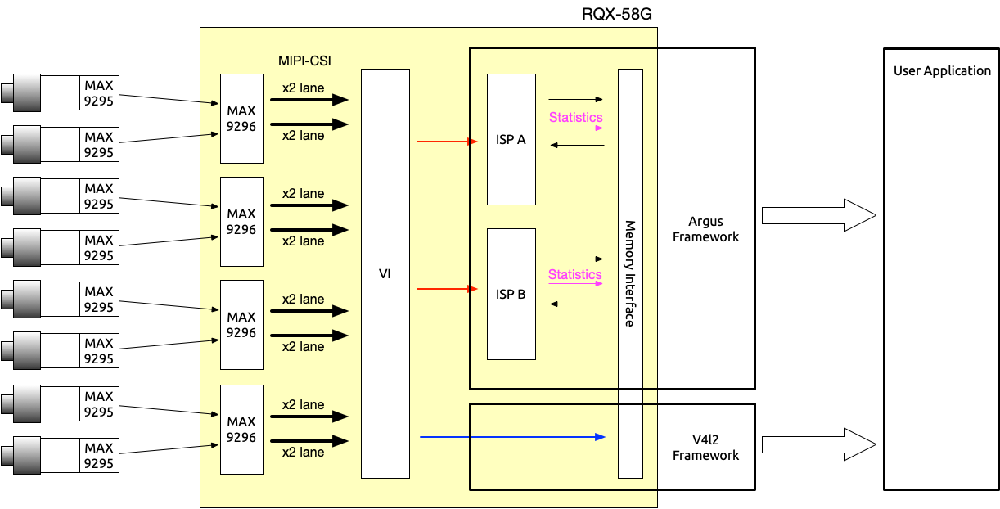

.. _system_diagram:

System Diagram
##############

Depends on camera type, some cameras equip with **ISP** and some do not. 

Users need to identify if their camera has an internal **ISP** or not. 

If yes, user can use **V4L2 framework** to access the camera's RAW image. 

If camera doesn't have a ISP inside their camera, they need to use **Argus Framework** which is provided by NVIDIA to access the camera's RAW image.