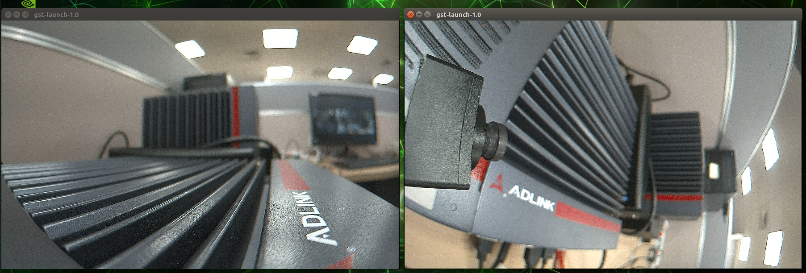

.. _test_result:

Test Result
###########

Cameras without ISP can use **Argus API** to preview the camera's video streaming. 

Or you can use **GStreamer NVArgusCameraSrc plugin** to preview the video streaming.

Video Frame Preview by GStreamer.
------------------------------------

Besure you have specify **sensor-id=0** on the following command.

+---------------+-----------+
| Camera Number | Sensor ID |
+===============+===========+     
| Camera 1      | 0         |
+---------------+-----------+
| Camera 2      | 1         |
+---------------+-----------+
| Camera 3      | 2         |
+---------------+-----------+
| Camera 4      | 3         |
+---------------+-----------+
| Camera 5      | 4         |
+---------------+-----------+
| Camera 6      | 5         |
+---------------+-----------+
| Camera 7      | 6         |
+---------------+-----------+
| Camera 8      | 7         |
+---------------+-----------+

i. Open a terminal and type command to open ``camera 1's video`` streaming.

.. code:: bash

    gst-launch-1.0 nvarguscamerasrc sensor-id=0 ! 'video/x-raw(memory:NVMM), width=2048, height=1280, framerate=30/1' ! nvvidconv flip-method=0 ! 'video/x-raw, format=(string)I420' ! xvimagesink -e

ii. Open **another** terminal and type command to ``open camera 2's video`` streaming.

.. code:: bash

    gst-launch-1.0 nvarguscamerasrc sensor-id=1 ! 'video/x-raw(memory:NVMM), width=2048, height=1280, framerate=30/1' ! nvvidconv flip-method=0 ! 'video/x-raw, format=(string)I420' ! xvimagesink -e

.. image:: images/gst-test.png
  :width: 80%
  :align: center

If successful, you will see two windows from different cameras, like below.

