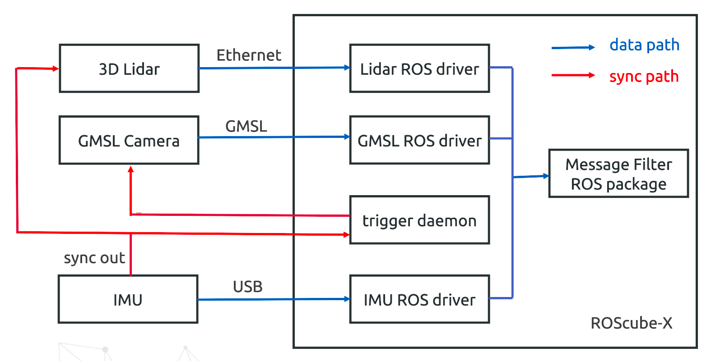

Architecture
============

In the scenario, we'll use the following hardware:

* Platform: ROScube-X 58G
* Camera: LI-AR0233-GMSL2.
* 3D Lidar: Velodyne VLP-16
* IMU: Xsens MTi-670-DK

Here is the architecture of our scenario:

The key point here is that we should use the same trigger source.
The trigger source we use is from Xsens IMU sync out.
Then it triggers 3D Lidar to do phase lock and triggers GMSL camera on ROScube-X

For the software, each kind of sensor needs to run their own ROS driver to get sensor data.
To put these sensor data together, we'll use message filter to collect them.
We'll compare the timestamp difference between the sensors.
It should be smaller than the case which is not synced.
