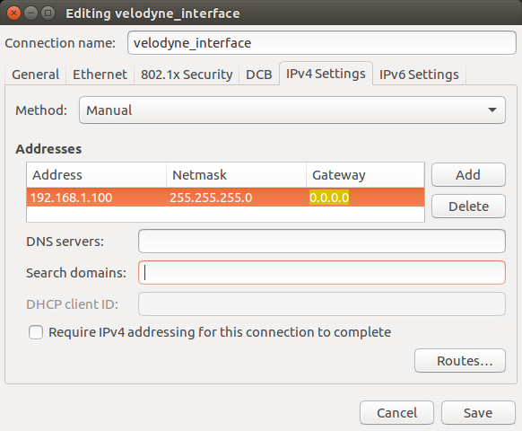
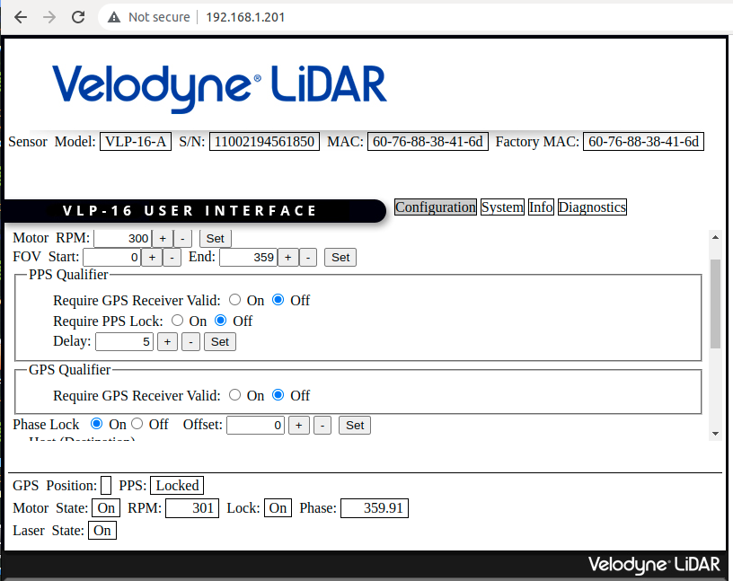

Configuration
=============

Before starting to work, we need to configure our devices:

* Camera
* 3D Lidar
* IMU

Camera
^^^^^^

Trigger mode
------------

Change the trigger mode on RQX-58G by following the commands below:

.. code-block:: bash

    su root
    echo 1 > /sys/module/leopard_ar0233/parameters/trigger_mode
    i2cset -f -y 2 0x66 0x04 0xff

For more information, click `here <https://adlink-ros.github.io/roscube-doc/roscube-x/gmsl_camera/frame_sync.html>`_.

3D Lidar
^^^^^^^^

Communicate
-----------

Setting up your computer to communicate with the Velodyne sensor

1. Power the Lidar.
2. Connect the Lidar to Ethernet port on your PC.
3. For now, disable the WiFi connection on your PC.
   
IP configuration
----------------

1. Open **Networks Connections** on your PC and click on **edit**. Choose the **IPV4 Settings** tab and change the **Method** field to **Manual**.
2. Click on “Add” and set the IP address field to ``192.168.1.100`` (”100” can be any number except in a range between 1 and 254, except 201).
3. Set the **Netmask** to ``255.255.255.0`` (24) and **Gateway** to ``0.0.0.0``.
4. To finish it click on **Save**.

Velodyne configurations
-----------------------

To check the connection open your web browser and access the following sensor's network address: ``192.168.XX.YY`` (default: ``192.168.1.201``). 

The following page should appear:

1. In this web, set the **Montor RPM** of 3D Lidar. Range from 300 (5 hz) to 1200 (20 hz).
2. set the **Phase Clock** to ``On`` and **save**.

IMU 
^^^

Configurations
--------------

Refer form `Interfacing an MTi GNSS/INS device with a Velodyne Lidar <https://base.xsens.com/s/article/Interfacing-an-MTi-GNSS-INS-device-with-a-Velodyne-Lidar?language=en_US>`_.

1. Start by configuring your MTi-6x0 to output the correct NMEA string and time data. The easiest way to do this is by using MT Manager, which is provided by `Xsens <https://www.xsens.com/software-downloads>`_. 

2. In MT Manager, open the Device Settings window. 

3. In the Synchronization Options tab, the ``Clock Bias Estimation (In)`` and the ``1PPS Time-pulse`` features should already be present in the list of configured settings, both on line **In 2**.

    * Click Add, and select the ``Interval Transition Measurement`` function. Set **Skip Factor to 399**. Leave the other fields as is. This will create a **1 PPS signal** on the SyncOut line of the MTi. Click Apply.

.. note::

    MT Manager didn't support with **ARM** version, so please use **x86** PC to do the setting.
     