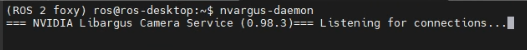

Result
======

Setup environment
^^^^^^^^^^^^^^^^^

Install ROS environment
-----------------------

We have provided the way how to isntall ROS enviroment, please click `here <https://adlink-ros.github.io/roscube-doc/neuronsdk/neuron_library/installation.html#installation>`_.

.. note:: 
    
    If you use NVIDA series platform (e.g. ROScube-X / ROScube Pico), suggest to **install ROS environment in container**.
    Since NVIDIA platform BSP is Ubuntu 18.04, it's inconvenient to run ROS 2 foxy, which is the ROS LTS version.
    Open Robotics only supports ROS 2 foxy on Ubuntu 20.04.

Install necessary packages
--------------------------

.. code-block:: bash

    sudo apt install wget

Get the code
------------

.. code-block:: bash

    mkdir -p sensors_pkg_ws/src
    cd sensors_pkg_ws
    wget https://raw.githubusercontent.com/Adlink-ROS/sensors_pkg/main/sensors.repos
    vcs import src < sensors.repos

Build xsens library 
-------------------

Refer to https://github.com/bluespace-ai/bluespace_ai_xsens_ros_mti_driver

.. code-block:: bash

    pushd src/bluespace_ai_xsens_ros_mti_driver/lib/xspublic && make && popd

Build
-----

.. code-block:: bash

    rosdep install --from-paths src --ignore-src -r -y
    colcon build --symlink-install
    source install/local_setup.bash

Usage
^^^^^

1. Run ``camera_trigger_daemon`` 
--------------------------------

* Run ``camera_trigger_daemon``  by command line:

.. code-block:: bash

    cd ~/camera_trigger_daemon
    # start daemon
    sudo python3 isr_camera start
    # stop daemon
    sudo python3 isr_camera stop

.. note::
    
    Trigger the frame first before running camera streaming. 

2. Run ``nvargus-daemon`` 
-------------------------

* Open **secound** terminal and run **ROS 2 foxy** by ``ros_menu``.

* Run ``nvargus-daemon`` by command line:

.. code-block:: bash

    nvargus-daemon

.. warning::

    If you find that Argus plugin can't operate well, you can restart ``nvargus-daemon``.

3. Launch ``sensors_pkg`` 
-------------------------

* Open **third** terminal and run **ROS 2 foxy** by ``ros_menu``.

* To view the timestamp of camera, lidar and imu by launch ``sensors_pkg``

.. code-block:: bash
    
    # To view the timestamp of camera, lidar and imu.
    ros2 run sensors_pkg sensor_subscriber

    # Launch camera, lidar and message filter at the same time
    ros2 launch sensors_pkg launch_sensors.launch.py
    
    # If you also want to enable IMU, add the option.
    # However, it'll affect the performance of message filter, so default is disable.
    ros2 launch sensors_pkg launch_sensors.launch.py enable_imu:=true

