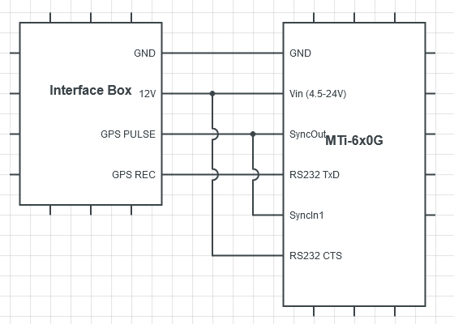

How to do synchronization
=========================

We has provided a daemon to tigger camera with external signal for **Frame Synchronization**.

* MTi 670/680 with SyncOut ⇒ Send 1 PPS
* ROScube X with mraa ⇒ GPIO ⇒ Trigger ISR + Camera

Interfacing
^^^^^^^^^^^

Refer form `Interfacing an MTi GNSS/INS device with a Velodyne Lidar <https://base.xsens.com/s/article/Interfacing-an-MTi-GNSS-INS-device-with-a-Velodyne-Lidar?language=en_US>`_.

The figure shows how to connect your MTi-6x0 to the Velodyne Interface Box.

Please note the following:

* For testing purposes it is possible to power the MTi-6x0G directly using the 12V supply available in the Interface Box.
* As mentioned in the MTi 600-series Hardware Integration Manual, the RS232 CTS line of the MTi-6x0G needs to be tied to a logical high (3-25V). Otherwise the MTi will not transmit data over the RS232 interface. 

Building
^^^^^^^^

Building the daemon from github.

Get the code
------------

.. code-block:: bash

    cd ~
    git clone https://github.com/Adlink-ROS/camera_trigger_daemon.git
    cd camera_trigger_daemon

Installation
------------

Mraa
****

.. code-block:: bash

    sudo add-apt-repository ppa:mraa/mraa
    sudo apt-get update
    sudo apt-get install libmraa2 libmraa-dev libmraa-java 
    sudo apt-get install python-mraa python3-mraa node-mraa mraa-tools

Neuron Library
**************

.. code-block:: bash

    # Setup ADLINK APT repository
    sudo apt install curl
    curl -L --insecure https://neuron.adlinktech.com/debian/repo_signing.key | sudo apt-key add -
    echo 'Acquire::https::neuron.adlinktech.com::Verify-Peer "false";' | sudo tee /etc/apt/apt.conf.d/99roscube > /dev/null
    echo 'Acquire::https::neuron.adlinktech.com::Verify-Host "false";' | sudo tee -a /etc/apt/apt.conf.d/99roscube > /dev/null
    echo "deb [arch=$(dpkg --print-architecture)] https://neuron.adlinktech.com/debian/common$(lsb_release -cs) main" | sudo tee /etc/apt/sources.list.d/roscube.list > /dev/null
    sudo apt update

    # Install Neuron Library
    sudo apt install neuron-library

Usage
^^^^^

Before start the daemon for **Frame Synchronization**, make sure that **interfacing** and **configurations** are correct.

The daemon provides four function:

* Start : trigger cameras with external signal.
* Stop : stop the daemon.
* Restart : stop and then start.
* Start_free : trigger cameras without external signal.

Default option:

* GPIO(ISR) = 5 pin
* trigger hz = 5 hz

To start the daemon
-------------------

.. code-block:: bash

    sudo python3 isr_camera.py start
    # Otherwise, trigger cameras by 10 hz and setting GPIO: 6 pin to interrupt.
    sudo python3 isr_camera.py start 10 6

To stop the daemon
------------------

.. code-block:: bash
    
    sudo python3 isr_camera.py stop

To restart the daemon
---------------------

.. code-block:: bash
    
    sudo python3 isr_camera.py restart

To start the daemon without the PPS
-----------------------------------

.. code-block:: bash

    sudo python3 isr_camera.py start_free
    # Otherwise, trigger cameras by 10 hz.
    sudo python3 isr_camera.py start_free 10

.. warning:: 

    If the daemon didn't work, please check the ``daemon.log`` file.

Testing
^^^^^^^

.. note:: 
    
    You should trigger the frame first before running camera streaming.

    And make sure the camera driver is installed.

    You can check camera devices by using command in terminal : ``ls /dev/video*``.

Cameras without ISP can use **Argus API** to preview the camera's video streaming, or you can use **GStreamer NVArgusCameraSrc plugin** to preview the video streaming.

.. code-block:: bash

    # Open a terminal and type command to open camera 1's video streaming.
    gst-launch-1.0 nvarguscamerasrc sensor-id=0 ! 'video/x-raw(memory:NVMM), width=2048, height=1280, framerate=30/1' ! nvvidconv flip-method=0 ! 'video/x-raw, format=(string)I420' ! xvimagesink -e
    # Can change the snesor-id for other cameras.